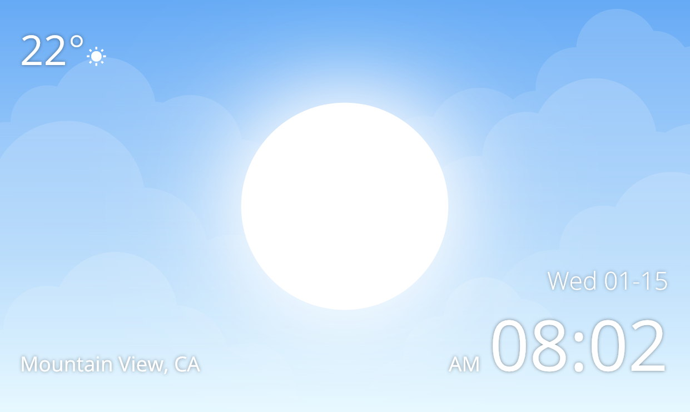
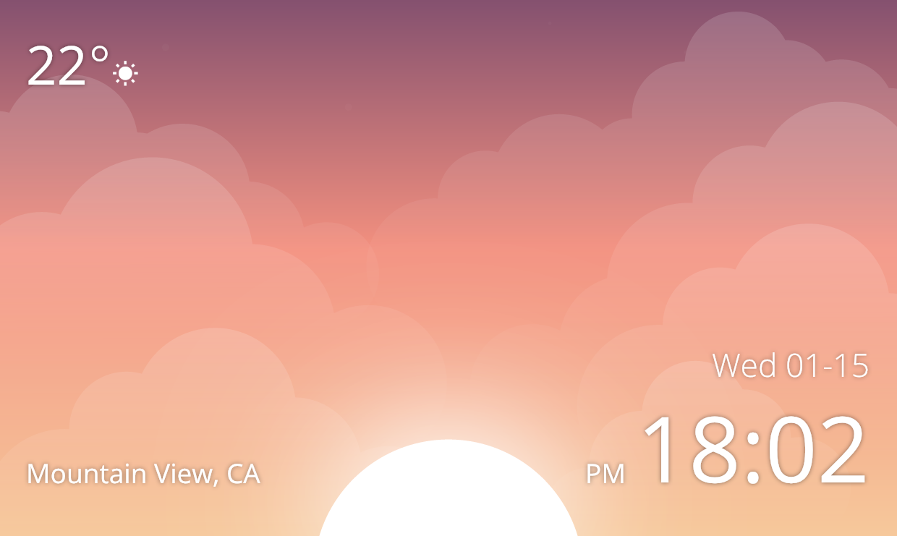
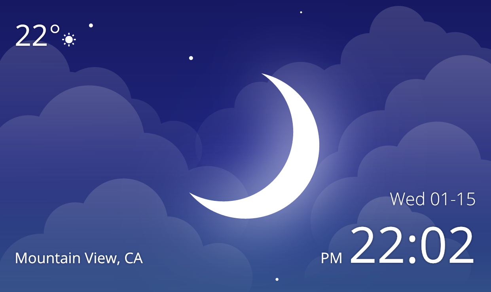

# CatClock


A beautiful sky clock app builded with [flutter](https://flutter.dev/).

> This project is submitted to [Flutter Clock challenge](https://flutter.dev/clock)

[Web live demo](https://imkcat.github.io/CatClock-Pages/)

## Getting Started

```bash
cd cat_clock
flutter create .
flutter run
```

## Screenshots

| Time    | Screenshot                |
| ------- | ------------------------- |
| Morning |  |
| Noon    |  |
| Sunset  |  |
| Night   |  |

## License

CatClock is available under the MIT license. See the LICENSE file for more info.
